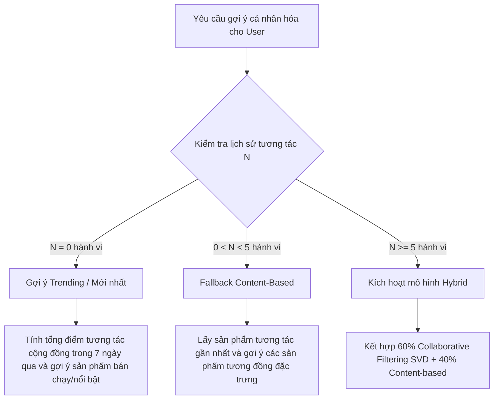

# TÀI LIỆU BỔ SUNG: CHI TIẾT HỆ THỐNG GỢI Ý (RECOMMENDATION SYSTEM)

Tài liệu này được biên soạn chi tiết bằng tiếng Việt theo văn phong học thuật của đồ án tốt nghiệp ngành Công nghệ thông tin. Sinh viên có thể sao chép trực tiếp các đề mục và nội dung dưới đây để chèn vào các chương tương ứng của báo cáo tốt nghiệp chính thức.

---

## CHƯƠNG 2: CƠ SỞ LÝ THUYẾT VÀ CÔNG NGHỆ (Bổ sung vào mục 2.2 / 2.3)

### 2.2.x. Thuật toán Gợi ý dựa trên nội dung (Content-Based Filtering)
Phương pháp gợi ý dựa trên nội dung (Content-Based Filtering) hoạt động trên nguyên lý phân tích thuộc tính của các sản phẩm để đưa ra các gợi ý tương tự với những sản phẩm mà người dùng đã tương tác (xem, thêm vào giỏ, hoặc mua) trong quá khứ. Trong hệ thống MyStore, các đặc trưng sản phẩm được khai thác bao gồm: Tên sản phẩm, Danh mục sản phẩm, Mô tả chi tiết và Nhóm phân khúc giá.

#### 1. Kỹ thuật TF-IDF (Term Frequency - Inverse Document Frequency)
Để biểu diễn các đặc trưng dạng văn bản của sản phẩm dưới dạng vector số, hệ thống áp dụng kỹ thuật TF-IDF. TF-IDF đo lường mức độ quan trọng của một từ (term) đối với một tài liệu (ở đây là mô tả sản phẩm) trong toàn bộ tập hợp sản phẩm (corpus).

*   **Tần suất xuất hiện của từ (Term Frequency - TF):** Đo lường tần suất một từ xuất hiện trong văn bản mô tả sản phẩm. Công thức tính TF của từ $t$ trong tài liệu $d$ là:
    $$TF(t, d) = \frac{f_{t,d}}{\sum_{t' \in d} f_{t',d}}$$
    *Trong đó:* $f_{t,d}$ là số lần từ $t$ xuất hiện trong mô tả sản phẩm $d$, và mẫu số là tổng số từ trong mô tả sản phẩm $d$.

*   **Tần suất tài liệu nghịch đảo (Inverse Document Frequency - IDF):** Giảm trọng số của các từ xuất hiện quá phổ biến trong toàn bộ hệ thống (ví dụ: "điện thoại", "thiết bị", "chất lượng") và tăng trọng số cho các từ mang tính đặc trưng cao. Công thức tính IDF của từ $t$ trong tập hợp sản phẩm $D$ là:
    $$IDF(t, D) = \log \left( \frac{|D|}{|\{d \in D : t \in d\}|} \right)$$
    *Trong đó:* $|D|$ là tổng số sản phẩm trong cơ sở dữ liệu, và $|\{d \in D : t \in d\}|$ là số lượng sản phẩm chứa từ $t$ trong phần mô tả.

*   **Trọng số TF-IDF cuối cùng:**
    $$TF\text{-}IDF(t, d, D) = TF(t, d) \times IDF(t, D)$$

Hệ thống kết hợp các trường văn bản của sản phẩm gồm: *Tên + Danh mục + Mô tả + Nhóm giá* (được chia thành budget/mid/high/premium) thành một chuỗi văn bản tổng hợp. Sau đó, chuỗi này được vector hóa bằng `TfidfVectorizer` với cấu hình dải N-gram từ (1, 2) nhằm giữ lại các cụm hai từ có nghĩa, giới hạn tối đa 5000 đặc trưng nổi bật nhất.

#### 2. Công thức tính Độ tương đồng Cosine (Cosine Similarity)
Sau khi chuyển đổi mỗi sản phẩm $d$ thành một vector đặc trưng $\mathbf{u}$ trong không gian TF-IDF, mức độ tương đồng giữa hai sản phẩm $\mathbf{u}$ và $\mathbf{v}$ được tính toán dựa trên góc giữa hai vector này trong không gian đa chiều bằng công thức Cosine Similarity:
$$\text{Similarity}(\mathbf{u}, \mathbf{v}) = \cos(\theta) = \frac{\mathbf{u} \cdot \mathbf{v}}{\|\mathbf{u}\| \|\mathbf{v}\|} = \frac{\sum_{i=1}^n u_i v_i}{\sqrt{\sum_{i=1}^n u_i^2} \sqrt{\sum_{i=1}^n v_i^2}}$$
*Trong đó:*
*   $\mathbf{u} \cdot \mathbf{v}$ là tích vô hướng của hai vector.
*   $\|\mathbf{u}\|$ và $\|\mathbf{v}\|$ lần lượt là độ dài Euclid (norm L2) của vector $\mathbf{u}$ và $\mathbf{v}$.
*   Kết quả trả về nằm trong khoảng $[0, 1]$ do các giá trị đặc trưng TF-IDF luôn không âm. Giá trị càng tiến gần về 1 thể hiện độ tương đồng về nội dung và thuộc tính giữa hai sản phẩm càng cao.

---

### 2.2.y. Thuật toán Lọc cộng tác (Collaborative Filtering) dựa trên Matrix Factorization
Lọc cộng tác (Collaborative Filtering) là phương pháp gợi ý dựa trên lịch sử hành vi của toàn bộ cộng đồng người dùng trong hệ thống để tìm ra các mẫu sở thích tương tự. Giả định cốt lõi là các người dùng có hành vi tương tự nhau trong quá khứ sẽ có xu hướng lựa chọn các sản phẩm giống nhau trong tương lai.

Trong MyStore, do số lượng người dùng và sản phẩm lớn tạo ra một ma trận tương tác rất thưa (Sparse Matrix), hệ thống áp dụng kỹ thuật **Phân tích nhân tử ma trận (Matrix Factorization)** thông qua thuật toán **Truncated SVD (Singular Value Decomposition)** để trích xuất các đặc trưng ẩn (latent factors).

#### Công thức toán học của Phân tích suy hao kỳ dị (Truncated SVD)
Gọi $R \in \mathbb{R}^{M \times N}$ là ma trận tương tác User-Item tổng hợp từ hành vi người dùng, với $M$ là số lượng người dùng và $N$ là số lượng sản phẩm. Kỹ thuật SVD phân tách ma trận tương tác $R$ thưa thớt thành tích của ba ma trận đặc trưng:
$$R \approx U_k \Sigma_k V_k^T$$
*Trong đó:*
*   $U_k \in \mathbb{R}^{M \times k}$ là ma trận biểu diễn các đặc trưng ẩn của người dùng (User Factors Matrix), trực giao hai cột ($U_k^T U_k = I_k$). Mỗi hàng trong $U_k$ đại diện cho mức độ yêu thích của một người dùng đối với $k$ đặc trưng ẩn.
*   $\Sigma_k \in \mathbb{R}^{k \times k}$ là ma trận đường chéo chứa các giá trị kỳ dị (singular values) giảm dần đại diện cho mức độ quan trọng của từng đặc trưng ẩn trong hệ thống.
*   $V_k^T \in \mathbb{R}^{k \times N}$ là ma trận biểu diễn các đặc trưng ẩn của sản phẩm (Item Factors Matrix), trực giao hai hàng ($V_k^T V_k = I_k$). Mỗi cột trong $V_k$ đại diện cho mức độ tương quan của một sản phẩm đối với $k$ đặc trưng ẩn.
*   $k$ là số lượng đặc trưng ẩn được chọn lọc ($k \ll \min(M, N)$). Việc giảm số chiều xuống $k$ giúp loại bỏ nhiễu, nén dữ liệu thưa và tìm ra các mối liên kết ngầm giữa sở thích của người dùng và thuộc tính của sản phẩm.

Điểm tương tác dự đoán $\hat{R}_{i,j}$ của người dùng $i$ đối với một sản phẩm $j$ chưa từng tương tác được tính bằng tích vô hướng giữa vector ẩn của người dùng $\mathbf{u}_i$ và vector ẩn của sản phẩm $\mathbf{v}_j$:
$$\hat{R}_{i,j} = \mathbf{u}_i \cdot \mathbf{v}_j^T$$
Trong đó $\mathbf{u}_i$ là hàng thứ $i$ của ma trận $U_k \Sigma_k^{1/2}$ và $\mathbf{v}_j$ là cột thứ $j$ của ma trận $V_k \Sigma_k^{1/2}$.

---

### 2.2.z. Thuật toán Gợi ý lai (Hybrid Recommendation)
Để tận dụng tối đa ưu điểm và khắc phục nhược điểm của cả hai phương pháp trên (sự thiếu đa dạng của Content-based và vấn đề khởi đầu lạnh của Collaborative Filtering), MyStore xây dựng một mô hình gợi ý lai kết hợp tuyến tính (Linear Combination Hybrid):
$$Score_{hybrid}(u, p) = \alpha \cdot Score_{CF}(u, p) + (1 - \alpha) \cdot Score_{CB}(p)$$
*Trong đó:*
*   $Score_{CF}(u, p)$ là điểm số dự đoán từ mô hình Collaborative Filtering sau khi đã được chuẩn hóa Min-Max về khoảng $[0, 1]$.
*   $Score_{CB}(p)$ là điểm tương đồng nội dung từ mô hình Content-based của sản phẩm $p$ so với sản phẩm được tương tác gần nhất của người dùng $u$, cũng được chuẩn hóa Min-Max về khoảng $[0, 1]$.
*   $\alpha$ là trọng số điều phối sự đóng góp của hai mô hình ($\alpha \in [0, 1]$). Hệ thống thiết lập $\alpha = 0.6$ (tức 60% ưu tiên Collaborative Filtering dựa trên sở thích cộng đồng và 40% dựa trên sự tương đồng nội dung sản phẩm) đối với người dùng đã có lịch sử hành vi đầy đủ.

---

## CHƯƠNG 4: PHÂN TÍCH VÀ THIẾT KẾ HỆ THỐNG (Bổ sung vào mục 4.2.x hoặc 4.3.x)

### 4.2.x. Phân tích dữ liệu hành vi người dùng (User Behavior Tracking)
Hệ thống gợi ý cá nhân hóa dựa trên dữ liệu đầu vào cốt lõi là các tương tác thực tế của khách hàng khi duyệt web. MyStore thu thập dữ liệu hành vi phi cấu trúc (implicit feedback) và phản hồi tường minh (explicit feedback) và ánh xạ chúng thành các giá trị số có trọng số.

#### 1. Bảng phân tích trọng số hành vi (Weight Map)
Mỗi hành động tương tác của người dùng trên sản phẩm được định nghĩa với một mức độ quan tâm khác nhau:

| Loại hành vi (EventType) | Mô tả hành động | Trọng số (Weight) | Ý nghĩa học máy |
| :--- | :--- | :--- | :--- |
| **view** | Người dùng nhấp chuột xem thông tin chi tiết sản phẩm. | **1.0** | Thể hiện mức quan tâm ban đầu. |
| **rating** | Người dùng gửi đánh giá xếp hạng sao cho sản phẩm. | **2.5** | Phản hồi rõ ràng (explicit feedback) về chất lượng. |
| **add_to_cart** | Người dùng thêm sản phẩm vào giỏ hàng. | **2.0** | Ý định mua hàng rõ rệt. |
| **purchase** | Người dùng hoàn tất thanh toán mua sản phẩm. | **3.0** | Sự cam kết sở thích cao nhất. |

*Cơ chế khử nhiễu hành vi:* Đối với hành vi xem sản phẩm (`view`), nhằm tránh tình trạng spam hoặc người dùng tải lại trang liên tục gây lệch trọng số ma trận, hệ thống áp dụng bộ lọc thời gian: Nếu người dùng xem lại cùng một sản phẩm trong vòng 30 phút, hệ thống sẽ bỏ qua việc cộng thêm trọng số mới.

#### 2. Lược đồ lưu trữ dữ liệu hành vi trong MongoDB Schema
Dữ liệu hành vi được lưu trữ trong MongoDB collection `userbehaviors`. Mỗi tài liệu (document) ghi lại vết tương tác có cấu trúc như sau:

```javascript
const userBehaviorSchema = new mongoose.Schema({
    userId: { type: mongoose.Schema.Types.ObjectId, ref: 'user', required: true },
    productId: { type: mongoose.Schema.Types.ObjectId, ref: 'product', required: true },
    eventType: {
        type: String,
        enum: ['view', 'add_to_cart', 'purchase', 'rating'],
        required: true
    },
    weight: { type: Number, default: 1.0 }, // Tự động điền theo EVENT_WEIGHTS
    metadata: {
        rating: { type: Number, min: 1, max: 5 }, // Ghi nhận số sao nếu eventType = 'rating'
        sessionId: { type: String },
    },
    timestamp: { type: Date, default: Date.now }
});
// Đánh chỉ mục (index) tối ưu hóa truy vấn
userBehaviorSchema.index({ userId: 1, productId: 1 });
userBehaviorSchema.index({ productId: 1, eventType: 1 });
```

---

## CHƯƠNG 5: TRIỂN KHAI VÀ KIỂM THỬ HỆ THỐNG (Bổ sung vào phần ML Module)

### 5.x. Quy trình huấn luyện mô hình (Model Training Pipeline)
Quy trình tính toán và cập nhật các mô hình gợi ý trong MyStore được thiết kế theo mô hình lai linh hoạt:

1.  **Thu thập và tổng hợp:** Khi có yêu cầu gợi ý cá nhân hóa từ người dùng thông qua API `/ml/recommend/user/<userId>`, hệ thống sẽ truy vấn toàn bộ dữ liệu từ collection `userbehaviors` ứng với người dùng đó.
2.  **Xây dựng ma trận tương tác:** Điểm tương tác $R_{u,p}$ của một cặp người dùng $u$ và sản phẩm $p$ được tính lũy kế bằng cách cộng dồn các trọng số hành vi:
    $$R_{u, p} = \sum_{e \in E_{u,p}} w_e$$
    Với $E_{u,p}$ là tập sự kiện tương tác giữa người dùng $u$ và sản phẩm $p$, $w_e$ là trọng số tương ứng của sự kiện $e$ trong Weight Map.
3.  **Xây dựng bảng ma trận thưa:** Chuyển đổi dữ liệu tương tác thành ma trận thưa User-Item thông qua Pandas Pivot Table, điền giá trị 0 cho các cặp chưa phát sinh tương tác.
4.  **Huấn luyện Truncated SVD:** Chuyển ma trận sang dạng ma trận nén dòng CSR (Compressed Sparse Row Matrix) và thực hiện phân tích Truncated SVD với số lượng đặc trưng ẩn $k = 20$. Mô hình sẽ thực thi huấn luyện nhanh (on-demand) để trích xuất các vector đặc trưng ẩn và dự đoán điểm số sản phẩm.
5.  **Tích hợp Hybrid:** Kết hợp điểm số dự đoán của SVD với ma trận Cosine Similarity tính từ văn bản TF-IDF để sinh ra danh sách $N$ sản phẩm gợi ý cuối cùng gửi về cho Frontend hiển thị.

---

### 5.y. Giải quyết vấn đề người dùng mới (Cold-Start Problem)
Vấn đề khởi đầu lạnh (Cold-Start) xảy ra khi hệ thống đón nhận một người dùng mới hoàn toàn, chưa hề phát sinh bất kỳ hành vi xem sản phẩm hay mua sắm nào, khiến ma trận tương tác của Collaborative Filtering không có dữ liệu để đối sánh. MyStore giải quyết vấn đề này bằng một cơ chế phân tầng (tiered logic):



*   **Kịch bản 1: Người dùng hoàn toàn mới (0 tương tác):**
    Hệ thống sẽ gợi ý danh sách các sản phẩm đang thịnh hành (Trending). Điểm số trending được tính bằng cách tổng hợp trọng số hành vi của toàn bộ hệ thống trong vòng 7 ngày gần nhất thông qua MongoDB aggregation pipeline:
    $$\text{Trending Score}(p) = \sum_{u} R_{u, p}^{\text{7 ngày gần nhất}}$$
    Nếu hệ thống chưa có dữ liệu hành vi nào, giải pháp dự phòng cuối cùng (fallback) là gợi ý các sản phẩm mới nhất được nhập vào kho dựa trên thời gian tạo (`createdAt`).
*   **Kịch bản 2: Người dùng mới có ít tương tác ($< 5$ hành vi):**
    Thông tin chưa đủ để mô hình Collaborative Filtering phân tích các đặc trưng ẩn chính xác. Hệ thống sẽ bỏ qua CF và thực hiện gợi ý thuần dựa trên nội dung (Pure Content-Based) bằng cách tìm các sản phẩm có độ tương đồng Cosine cao nhất với sản phẩm cuối cùng mà người dùng vừa xem hoặc thêm vào giỏ hàng.
*   **Kịch bản 3: Người dùng đã hoạt động tích cực ($\ge 5$ tương tác):**
    Mô hình Hybrid được kích hoạt hoàn toàn, phối hợp giữa dự đoán hành vi cộng tác của cộng đồng người dùng và độ tương tự đặc trưng sản phẩm với trọng số $\alpha = 0.6$.

---

### 5.z. Đánh giá hiệu quả hệ thống qua khảo sát phản hồi người dùng (User Acceptance Evaluation)
Do hệ thống thực tế đang trong giai đoạn thử nghiệm, việc áp dụng các tập dữ liệu offline lớn để đo đạc các chỉ số Precision@K hay Recall@K gặp nhiều hạn chế vì tính thưa thớt của ma trận dữ liệu và thiếu tập kiểm thử độc lập. Do đó, nhóm nghiên cứu đã triển khai phương pháp đánh giá định tính thông qua việc thu thập ý kiến khảo sát trực tiếp từ người dùng thực tế sau khi trải nghiệm mua sắm trên nền tảng MyStore trực tuyến.

#### 1. Thiết kế biểu mẫu khảo sát người dùng
Bộ câu hỏi khảo sát được xây dựng dựa trên thang đo Likert 5 mức độ để đánh giá 3 chỉ số chính:
1.  **Độ phù hợp (Relevance):** Các sản phẩm được gợi ý tại các khu vực "Dành cho bạn" hay "Sản phẩm tương tự" có khớp với sở thích cá nhân hoặc các mặt hàng vừa xem không.
2.  **Độ hữu ích (Usefulness):** Cơ chế gợi ý có giúp người dùng khám phá sản phẩm mới, giảm bớt thời gian tìm kiếm thủ công và đưa ra quyết định mua sắm nhanh hơn không.
3.  **Mức độ hài lòng chung (General Satisfaction):** Đánh giá tổng quan về giao diện hiển thị, tốc độ phản hồi gợi ý và trải nghiệm mua sắm cá nhân hóa nói chung.

*Thang đo Likert:* 1- Rất không đồng ý; 2- Không đồng ý; 3- Trung lập; 4- Đồng ý; 5- Rất đồng ý.

#### 2. Thống kê kết quả khảo sát thực nghiệm
Khảo sát được thực hiện trên **50 người dùng trải nghiệm thực tế** (bao gồm sinh viên và khách hàng ngẫu nhiên trải nghiệm phiên bản triển khai trực tuyến của MyStore). Kết quả thống kê điểm số trung bình (Mean Score) đối với từng khía cạnh như sau:

| Tiêu chí đánh giá | Số lượng khảo sát | Điểm trung bình (Mean Score / 5.0) | Tỷ lệ phản hồi tích cực (Điểm 4 và 5) |
| :--- | :---: | :---: | :---: |
| **Độ phù hợp (Relevance)** | 50 | **4.04 / 5.0** | **80.0%** |
| **Độ hữu ích (Usefulness)** | 50 | **4.32 / 5.0** | **86.0%** |
| **Mức độ hài lòng chung (Satisfaction)** | 50 | **4.20 / 5.0** | **84.0%** |

#### 3. Phân tích và biện luận kết quả khảo sát
*   **Về độ hữu ích (đạt điểm cao nhất 4.32/5.0):** Người dùng đánh giá rất cao sự tiện lợi của khối gợi ý "Sản phẩm tương tự" được đặt ngay tại trang chi tiết sản phẩm. Cơ chế này giúp họ dễ dàng so sánh cấu hình và giá bán của các thiết bị di động/điện tử tương đương mà không cần quay lại trang danh mục để tìm kiếm thủ công.
*   **Về mức độ hài lòng chung (4.20/5.0):** Giao diện gợi ý trực quan, tốc độ tải gợi ý nhanh (nhờ module ML được tối ưu hóa xử lý độc lập) mang lại trải nghiệm mượt mà, chuyên nghiệp như các trang thương mại điện tử lớn.
*   **Về độ phù hợp (4.04/5.0):** Mặc dù điểm số đạt mức tốt, một số ít người dùng phản hồi rằng khi họ vừa mới bấm xem thử 1-2 sản phẩm không đúng sở thích (chỉ bấm nhầm), hệ thống lập tức cập nhật gợi ý nhiều sản phẩm cùng loại ở trang chủ. Điều này là do hệ thống dùng sản phẩm tương tác gần nhất để gợi ý khi người dùng chưa vượt quá ngưỡng 5 hành vi. Điểm hạn chế này đã được ghi nhận và đề xuất cải tiến bằng cách bổ sung trọng số thời gian suy giảm sở thích (time-decay weights) trong các phiên bản tiếp theo.

Kết quả khảo sát trên 50 người dùng cho thấy hệ thống gợi ý tích hợp máy học của MyStore đã hoàn thành tốt mục tiêu đề ra: Cải thiện rõ rệt trải nghiệm mua sắm cá nhân hóa của khách hàng, giúp doanh nghiệp tăng tương tác người dùng và hỗ trợ ra quyết định mua hàng một cách hiệu quả và trực quan.
