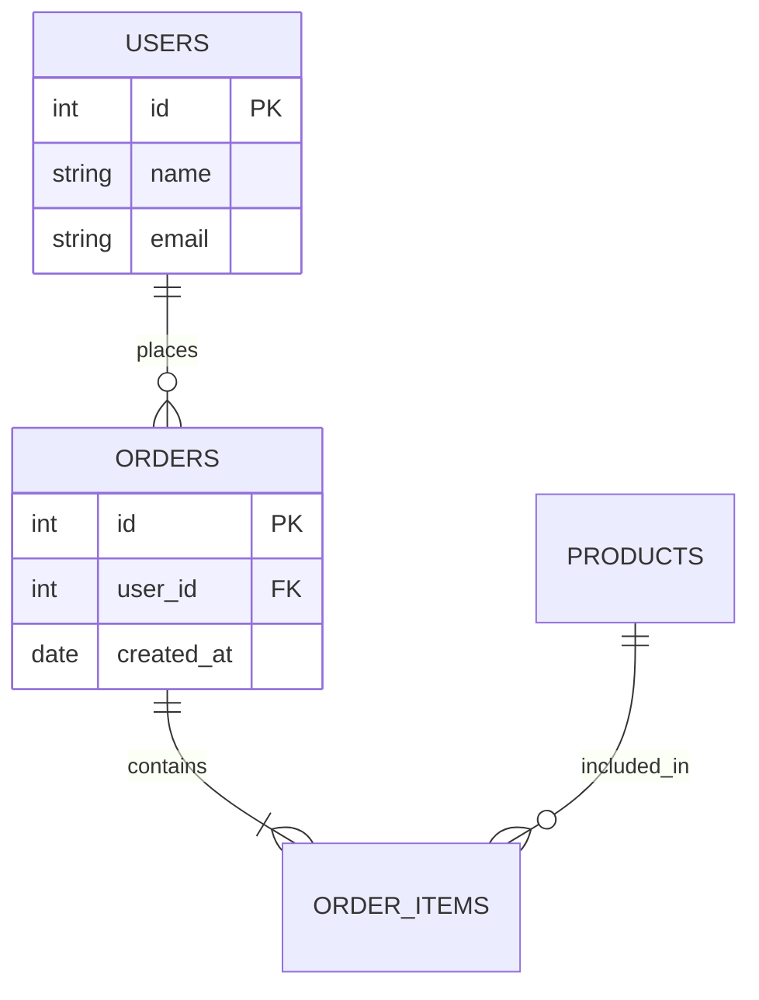

# 🧠 Database Schema Analyzer Prompt

## 🎯 Mục tiêu

Phân tích cấu trúc database từ dữ liệu đầu vào và tạo sơ đồ quan hệ (ERD) + mô tả chi tiết các bảng.

---

## 📥 Input

Tôi sẽ cung cấp một trong các dạng sau:

* SQL schema (CREATE TABLE ...)
* Danh sách bảng + cột
* Hoặc dump database

---

## ⚙️ Yêu cầu xử lý

Hãy thực hiện các bước sau:

### 1. Phân tích cấu trúc

* Liệt kê tất cả bảng
* Xác định:

  * Primary Key (PK)
  * Foreign Key (FK)
  * Unique key
  * Các field quan trọng

---

### 2. Xác định quan hệ

* Quan hệ giữa các bảng:

  * One-to-One (1-1)
  * One-to-Many (1-N)
  * Many-to-Many (N-N)
* Giải thích rõ từng mối quan hệ

---

### 3. Sinh ERD (Entity Relationship Diagram)

#### Output dạng:

* Mermaid ERD (ưu tiên)
* Hoặc dạng text dễ vẽ lại

Ví dụ format Mermaid:



---

### 4. Gợi ý cải thiện (quan trọng)

* Phát hiện lỗi thiết kế:

  * dư thừa dữ liệu
  * thiếu index
  * thiếu FK
* Đề xuất tối ưu:

  * chuẩn hóa (normalization)
  * tách bảng / gộp bảng

---

### 5. Tóm tắt dễ hiểu

* Mô tả database hoạt động như thế nào (business flow)
* Viết ngắn gọn dễ hiểu cho dev mới đọc

---

## 📤 Output mong muốn

* Danh sách bảng + mô tả
* Quan hệ giữa bảng
* ERD (Mermaid)
* Gợi ý cải thiện
* Summary hệ thống

---

## ⚠️ Lưu ý

* Nếu thiếu dữ liệu → hỏi lại tôi
* Không tự đoán sai logic nghiệp vụ
* Ưu tiên rõ ràng, dễ đọc

---

## 🚀 Bắt đầu

Dưới đây là schema của tôi:

```
<PASTE DATABASE SCHEMA HERE>
```
